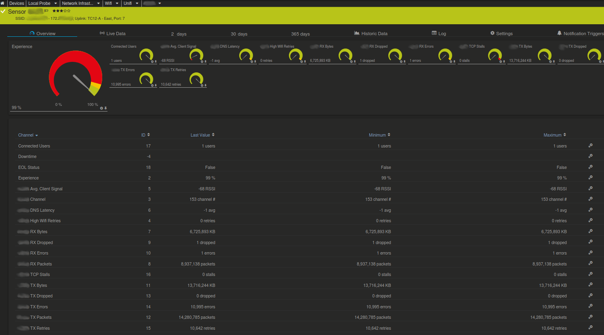

# Unifi Controller Access Point Monitoring with PRTG
Custom EXE/XML script for PRTG to monitor Ubiquiti wifi access points with data from the Unifi controller.

- Greater amount of values available, than the MIBs from Ubiquiti
- Detailed info in the status message, such as SSID, uplink switch and port number (if using Ubiquiti switches)
- Pre-set errors and warnings for poor wifi experience and sketchy RSSI quality (customize to suit)
- Caching of API results so infrastructures with a *lot* of access points aren't making needless concurrent network requests




## Test the Script Without 'Installing'
1. Make a copy of [unifi-ap.ps1](unifi-ap.ps1) on your desktop
2. Open **Powershell ISE** > open `unifi-ap.ps1`
3. In the console window, make sure you `cd C:\youruser\Desktop`, first
4. Set your parameters as command-line arguments, like so:
  ```powershell
   .\ubiquiti-ap.ps1 -server 'unifi.example.com' -site 'default' -port '8443' -user 'apiuser' -password 'apipassword' -apip '172.16.5.1'
  ```
  - Replace the example values for yours; note that `apip` is the IP address of the access point you're going to test with
5. Running the above should yield the XML output that PRTG will parse
6. When you're done testing and have all of the values you want, move `cd C:\youruser\Desktop\unifi-ap.ps1` into `C:\Program Files (x86)\PRTG Network Monitor\Custom Sensors\EXEXML`


## Setup
The following are suggestions for those that may be unfamiliar with custom script setups, feel free to adjust to suit.

### Create a Read-Only API User on the Unifi Controller
Login to your Unifi controller:
- Settings > Admins > Add New Admin
  - Set appropriate permissions
  - Under **Role**, select `Read Only`
  - Make note of the username & password, as they will be input to PRTG, so the script can access the controller's API

### Add the Script to PRTG & Set Up Devices and Sensors
1. After testing, put the [unifi-ap.ps1](unifi-ap.ps1) script in `C:\Program Files (x86)\PRTG Network Monitor\Custom Sensors\EXEXML`
2. Create a group, if you don't already have one.  Mine is structured like so:
  - Devices > Local Probe > Network Infrastructure > Wifi
3. Un-tick 'Credentials for Windows Systems' (assuming you don't use the same credentials for unrelated systems)
  - Domain or Computer Name: `unifi.example.com` (your controller hostname)
  - User Name: `controllerapiuser`
  - Password: `controllerapipass`
4. Un-tick 'Scanning Interval' and set to `5 minutes` (probably less important if you don't have a lot of access points)
  - Select `Set sensor to down immediately`
5. Optionally set a schedule for work hours for `Schedules, Dependencies, and Maintenance Windows` so you don't get any alerts when no one's in the office
6. Save
7. Under your `Wifi` group (or equivalent), click **Add Device**
  - Device name: `Name/description of your Ubiquiti network`
  - IPv4 Address/DNS Name: `172.16.5.0` (IP of the controller, or 127.0.0.1 - this is really just a placeholder, so it doesn't matter so much)
    - If you scroll down to the toggle options below, you'll see its inhering stuff from the `Wifi` group already
  - Click OK
8. Go into the newly created device/controller and click the **+** button to add a new sensor
  - In the preceeding page, search `xml` and select: `EXE/Script Advanced`
  - Sensor Name: `Name/description of the access point`
  - EXE/Script: select `unifi-ap.ps1`
  - Parameters:

    ```powershell
    -server '%host' -site 'default' -port '8443' -user '%windowsuser' -password '%windowspassword' -apip '172.16.5.31'
    ```

    - Adjust to suit; if you did step #3 similarly to me, the values with the variabals won't need to be changed
    - **apip** should be adjusted to reflect the access point you're adding
    - Click Create
9. Repeat for any other access points you'd like to add

## Customizing
You can adjust the lifetime of the API cache by modifying the `$cacheLife` value directly in the `param()` portion script.  This value is used to check and see how many seconds old the cache is and is the determinator on whether or not to grab a new copy.
- Must be a negative value; for a max of 5 mins old, set `-300` (300 seconds old)
- Leave the rest of the params blank and pass them from PRTG (or through the ISE, if testing)

**Note:** Because custom scripts are heavier sensors, use caution when setting both the cache and scanning frequency too low.  PRTG recommends 5 mins scanning interval for these types of sensors.

## Adding More Channels
After first run, a copy of the API's output will be saved to `C:\ProgramData\Paessler\PRTG Network Monitor\Logs (Sensors)\unifi-ap-cache.json` - open in any text editor.

All of the values returned can be added as channels, if any of the defaults are missing data you need to monitor.

### Credits
This is a fork of [Luciano Lingnau's script](https://kb.paessler.com/en/topic/71263-can-i-monitor-ubiquiti-unifi-network-devices-with-prtg)

My contributions are GPLv3

### Other Wifi Troubleshooting Tools
You might also find these useful:

- [Wavemon](https://github.com/uoaerg/wavemon) - ncurses-based monitoring application for wireless network devices on Linux

- [Speedtest](https://greiginsydney.com/new-ooklaspeedtest-ps1/) - Custom script for PRTG using Ookla's Speedtest

- [Wifi Network Testing](https://github.com/angela-d/wifi-network-testing) - Scan your wifi network and obtain troubleshooting details, with extreme granularity - using a colorful command-line tool.

- [Wifi Channel Watcher](https://github.com/angela-d/wifi-channel-watcher) - Monitor channel usage of neighboring routers & get an alert if your active channel is not optimal.
